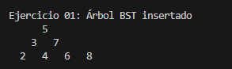
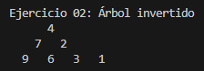
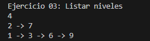
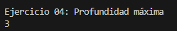

# Estructuras No Lineales – Ejercicios Árboles

Este proyecto contiene la solución a cuatro ejercicios prácticos sobre estructuras de datos tipo árbol binario, como parte del aprendizaje de estructuras no lineales en Java. Cada ejercicio se encuentra organizado en su propia carpeta, siguiendo la convención de paquetes y buenas prácticas.

---

## Identificación del Estudiante (Obligatorio)

Antes de comenzar a programar o ejecutar el proyecto, **debes completar tu nombre y correo institucional en el archivo `student.env`** que se encuentra en la raíz del proyecto. Este archivo es necesario para validar tu identidad como autor del trabajo.

### ¿Por qué es obligatorio?

Este proyecto utiliza una verificación automática que valida que has ingresado tu información personal. Si no lo haces:

- Al ejecutar el proyecto (`App.java`) verás este mensaje de error:
```
❌ Debes completar STUDENT_NAME y STUDENT_EMAIL en student.env
```
- No podrás enviar tu código (`push`) al repositorio si tienes activado el sistema de validación local.
- Las pruebas automáticas en GitHub Actions también fallarán si no detectan tu nombre y correo.

### ¿Qué debo hacer?

1. Abre el archivo `student.env` que ya está creado en el proyecto.
2. Rellena tus datos:

```
STUDENT_NAME=Tu Nombre Completo
STUDENT_EMAIL=tu.correo@institucion.edu.ec
```


3. **No borres estas líneas ni cambies los nombres de las variables.**
4. Guarda los cambios y vuelve a ejecutar el programa o hacer push.

> 💡 Este mecanismo asegura la autoría del código y que cada estudiante reciba su evaluación automática de forma personalizada.

---


## Explicación para el estudiante

```
src/
│
├── Materia/
│
├── Ejercicio_01_insert/
├── Ejercicio_02_invert/
├── Ejercicio_03_listLeves/
└── Ejercicio_04_depth/
```

---

## Descripción de Ejercicios

### Ejercicio 01: Insertar en un Árbol Binario de Búsqueda (BST)

Carpeta: `Ejercicio_01_insert`
Implementa un algoritmo para insertar nodos en un Árbol Binario de Búsqueda.

 **Input de ejemplo:** `[5, 3, 7, 2, 4, 6, 8]`
 **Output esperado:**

```
    5
  3   7
 2 4 6 8
```

---

### Ejercicio 02: Invertir un Árbol Binario

📂 Carpeta: `Ejercicio_02_invert`
Dada la raíz de un árbol binario, el algoritmo devuelve su versión invertida (espejo).

 **Input de ejemplo:**

```
    4
  2   7
1  3 6  9
```

**Output esperado:**

```
    4
  7   2
9  6 3  1
```

---

### Ejercicio 03: Listar Niveles en Listas Enlazadas

📂 Carpeta: `Ejercicio_03_listLeves`
Devuelve una lista enlazada con los nodos por nivel. Si hay N niveles, se obtienen N listas.

 **Input de ejemplo:**

```
    4
  2   7
1  3 6  9
```

**Output esperado:**

```
4  
2 → 7  
1 → 3 → 6 → 9
```

---

### Ejercicio 04: Calcular la Profundidad Máxima

Carpeta: `Ejercicio_04_depth`
Calcula la profundidad máxima de un árbol binario (la longitud del camino más largo desde la raíz hasta una hoja).

**Input de ejemplo:**

```
    4
  2   7
1  3  
8
```

**Output esperado:** `4`

---

## Indicaciones Generales

* Lee cuidadosamente el enunciado de cada ejercicio.
* Cada carpeta debe contener:

  * Código fuente Java.
  * Casos de prueba.
  * Comentarios claros.
* Realiza commit y push con el mensaje:

  ```
  Estructuras No Lineales – Ejercicios Árboles
  ```
* En el AVAC, sube la **URL del repositorio** con el código.

---

## No se calificará si:

* No hay commit con los ejercicios.
* No se incluye este README explicativo.
* Las clases o métodos no siguen los nombres requeridos.

---

## Rúbrica de Calificación

| **Criterio**       | **Descripción**                                                                       | **Puntaje** |
| ------------------ | ------------------------------------------------------------------------------------- | ----------- |
| **Informe**        | No hay informe                                                                        | 0 pts       |
|                    | Informe parcial **sin explicación** de cada método                                    | 1 pt        |
|                    | Informe parcial **con explicación** de cada método                                    | 2 pts       |
|                    | Informe completo                                                                      | 3 pts       |
| **Funcionamiento** | No implementado                                                                       | 0 pts       |
|                    | Implementado parcialmente: <br>• Ejercicio 1 y 4 → 2 pts<br>• Ejercicio 2 y 3 → 4 pts | 2–4 pts     |
|                    | Código funcional pero **no pasa todas las pruebas**                                   | 6 pts       |
|                    | Código funcional y **pasa todas las pruebas correctamente**                           | 7 pts       |


## Contribuir

Para contribuir a este proyecto, por favor crea un fork y envía una solicitud de extracción, o simplemente abre un issue con tus comentarios y sugerencias.

## Autores

- [PABLO TORRES] - Desarrollo inicial

##  Informe sobre Ejercicios de Arboles Binarios

Nombre: Nelson Matias Villalta Vasquez
Curso:(A) ESTRUCTURA DE DATOS GRUPO - 2 - COMPUTACIÓN - CUE
Fecha: 06/07/2025


##  Introducion
En este informe se analizaran y describiran 4 ejercicios relacionados directamente con arboles binarios, con estructura fundamental ne la informatica y la programacion. Los ejercicios incluyen la insercion de nodos en un arbol binario de busqueda, la inversion o la reversa de un arbol binario, la obtencion de los nodos por niveles en las respectivas listas y el calculo de la profundidad maxima que posee uno de los arboles.

##  Ejercicio 01: Insercion en Arbol binario de busqueda

Se implemento un algoritmo para insertar nodos en un arbol BST. Este tipo de arbol mantiene la propiedad de que para cada nodo, todos los valores en el subarbol izquierdo son menores y todos los del subarbol derecho son mayores o iguales.

##  Funcionamiento
El metodo recibe la raiz del arbol y un valor para su respectiva insercion.
*Si la raiz es null, este crea un nuevo nodo con el valor.
*Si el valor a insertar es menor que el valor de la raiz, se inserta recursivamente en el subarbol izquierdo.
*Si es lo contrario, se coloca en el subarbol derecho.



##  Ejercicio 02: Invertir un Arbol Binario

En este ejercicio se invierte un arbol binario, generando su contraparte invertida. Cambiando los nodos izquierdos por los derechos.

##  Funcionamiento
El metodo recibe la raiz y si no es de valor null, esta intercambia los subarboles izquierdo y derecho-



## Ejercicio 03:  Listar Niveles en listas enlzadas

Se crea una lista en donde cada sublita contiene los nodos en el mismo nivel del arbol.

##  Funcionamiento

Se usa una cola para poder recorrer el arbol por niveles. Para cada nivel, se le añade la lista de nodos a la lista principal.



##  Ejercicio 04: Calcular la Profundidad Maxima

Calcula la profundidad maxima/total de un arbol, comprendida como la longitud del camino mas largo desde la raiz origen hasta una hoja.

##  Funcionamiento

Recursivamente se encarga de calcular la profundidad del subarbol izquierdo y derecho y luego devuelve el mayor valor mas 1



##  Conclusiones

Los arboles binarios son estructuras de datos verstiles y variados muy fundamentales en la programacion.

La insercion en un tipo BST contiene orden y permite busquedas eficientes.

Listar los nodos por niveles ayuda a recorrer el arbol de forma ordenada y es base para muchos algoritmos.

Calcular la profundidad maxima permite un conocimiento acerca de la altura o el tamaño total del aarbol, importante para analizar su balance y eficiencia.